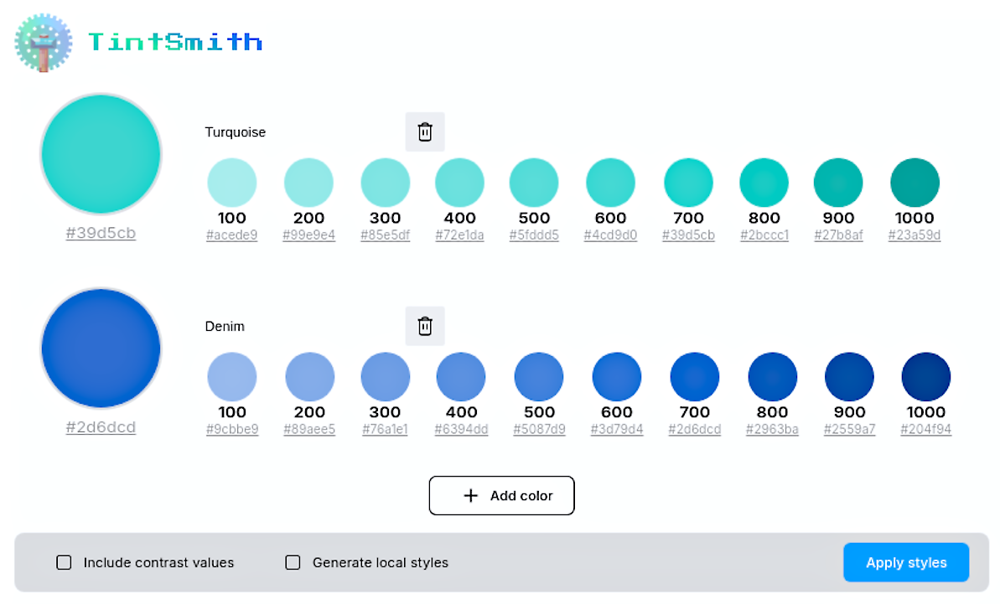
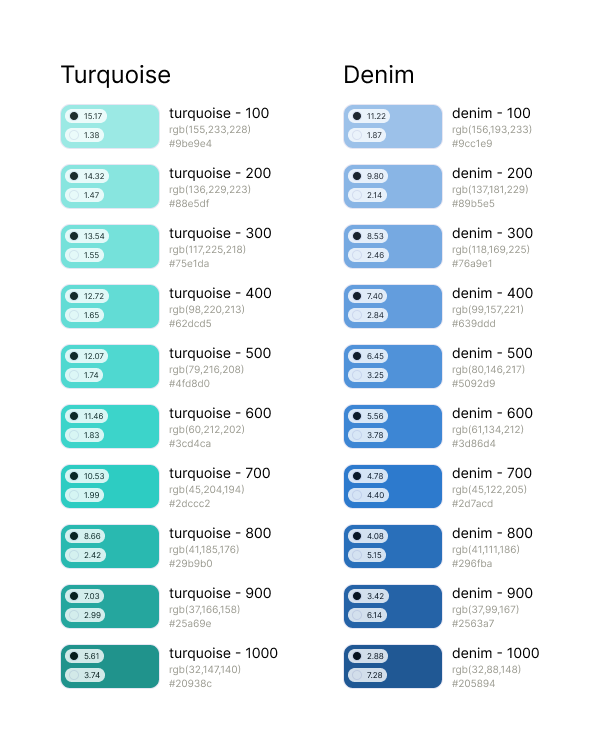

# TintSmith - Figma Color Scheme Plugin

### Overview

Welcome to TintSmith! This Figma plugin generates tints from given colors and includes calculated semantic colors. Perfect for designers looking to enhance their color palettes quickly and efficiently.

### Features

- Generate tints from any selected color.
- Custom Palettes: Save your favorite color palettes for easy access and reuse.
- Real-time Preview: See how the colors look on your design in real-time.
- Easy Integration: Apply color schemes to your Figma Color Styles effortlessly.
- Generate beautiful colors to Design Kit.
- Get contrast colors from black and white.
 
### Future additions

- Create calculated semantic colors for consistent UI designs.
- Export color schemes in various formats (CSS, JSON, etc.).
- Get contrast colors from color combinations.

### Image Examples

#### Plugin Preview

#### Design Kit Generated

### Collaborators

[Nathyane Moreno](https://github.com/nathyanemoreno)
